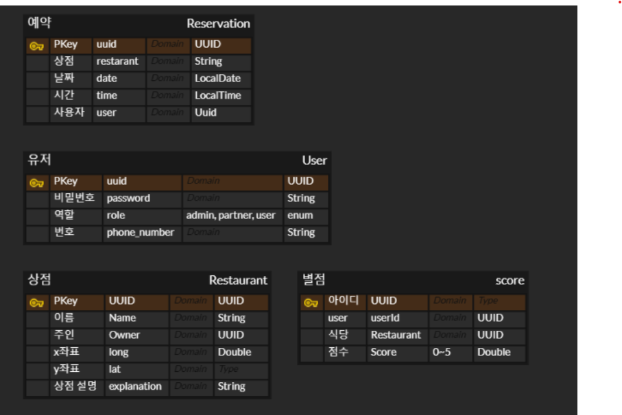

# 식당 예약 서비스

## API 리스트
- 회원 가입 : 3가지의 Role 설정(ADMIN, PARTNER, USER). 중복 가입 불가능
- 회원 로그인 : Jwt token값 전달
- 매장 등록 : 매장 중복 등록 불가, Partner 회원만 저장 가능
- 전체 매장 리스트 가져오기 : 리뷰 테이블에서 점수 평균을 같이 반환, 페이지 interface로 전달
- 매장 상세 정보 가져오기 : 매장 id 값 전달
- 매장 정보 수정 : 가게를 등록한 사람만 수정 가능
- 매장 삭제 : 가게를 등록한 사람만 삭제 가능
- 매장 예약 : 해당 시간대에 예약 없는지 확인 후 예약 가능, user 회원만 가능, 매장 내 모든 테이블이 예약 완료 시 예약 불가능, 현재보다 이른 시간대 예약 시도시 불가능
- 매장 예약 목록 불러오기 : 해당 유저가 예약한 모든 예약들 불러오기
- 도착 확인 : 해당 예약을 등록한 사용자에게 요청이 왔는지 확인, 예약보다 10분 이상 전이면 못함
- 리뷰 작성 : 도착을 한 사람만 가능. 같은 예약에 대해 여러번 리뷰 작성 불가
- 작성 리뷰 확인 : 로그인한 유저가 작성한 전체 리뷰 확인
- 리뷰 수정 : 작성자만 수정 가능
- 리뷰 삭제 : 작성자, 관리자 모두 가능

[API Document 바로가기](https://documenter.getpostman.com/view/40737812/2sAYkHoJaA)

## [ERD(클릭시 페이지 이동)](https://www.erdcloud.com/d/smDikgt573kNAKBsC) 

## 사용 스택

