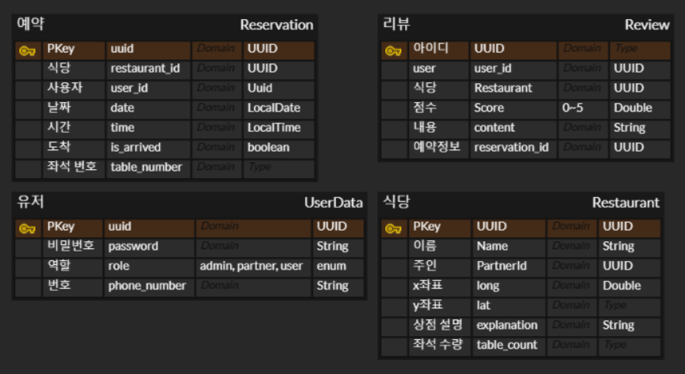

# 식당 예약 서비스

## API 리스트
- 회원 가입 : 3가지의 Role 설정(ADMIN, PARTNER, USER). 중복 가입 불가능
- 회원 로그인 : Jwt token값 전달
- 매장 등록 : 매장 중복 등록 불가, Partner 회원만 저장 가능
- 매장 리스트 가져오기 : 리뷰 테이블에서 점수 평균을 같이 반환, 페이지 interface로 전달

## 진행 예정
- 매장 수정 : > ID 필요
- 매장 삭제 : 해당 매장의 등록자인지 확인
- 예약 진행 : 해당 시간대에 예약 없는지 확인
- 도착 확인 : 해당 예약을 등록한 사용자에게 요청이 왔는지 확인, 예약보다 10분 이상 전이면 못함
- 리뷰 작성 : 도착을 한 사람만 가능
- 리뷰 수정 : 작성자만 가능
- 리뷰 삭제 : 작성자, 관리자 모두 가능

## [ERD](https://www.erdcloud.com/d/smDikgt573kNAKBsC) 

## 사용 스택

